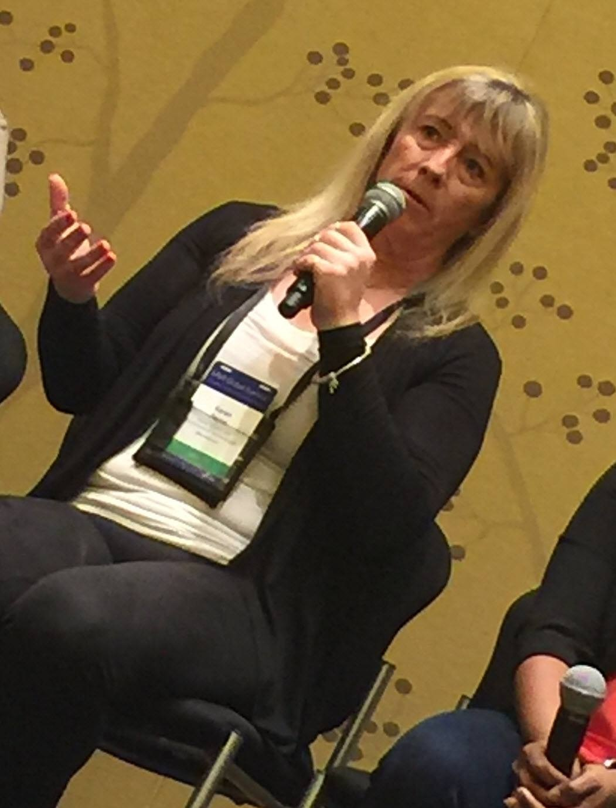

### Hi there 👋

**Speaking at a Microsoft event 2020**

I’m a software developer writing applications in various programming languages from way back with [Nantucket Clipper](https://en.wikipedia.org/wiki/Clipper_(programming_language)), [Delphi](https://en.wikipedia.org/wiki/Delphi_(software)), [Cold Fusion](https://en.wikipedia.org/wiki/Adobe_ColdFusion) with the majority of coding using various flavors of C, C++ and [C#](https://learn.microsoft.com/en-us/dotnet/csharp/). 

Have been teaching software development for over 20 years with focus on beginners and intermediate level developers as I like to get them before they form bad habits. 

Over the years I get called on writing solutions that are fairly complex and stand the test of time. This is due to proper planning and testing.

Outside of work I teach personal protection ranging from hand to hand, knife counter knife, impact weapons and firearms. 

My current passion is driving one of my two Mazda Miatas which are highly modified for in short handling twisty roads at high speeds.

My repositories: they are for teaching and sharing my knowledge. I seldomly present web solutions as this is what I do at work and honestly believe that new developers should focus on console and test projects. Will use Windows forms as a next level to console projects. 

As of September 2022 I've started writing about ASP.NET Core starting with Razor pages, next up Blazer.

<!--

Connect on [Twitter](https://twitter.com/KarenPayneMVP)

  

**karenpayneoregon/karenpayneoregon** is a ✨ _special_ ✨ repository because its `README.md` (this file) appears on your GitHub profile.

Here are some ideas to get you started:

- 🔭 I’m currently working on ...
- 🌱 I’m currently learning ...
- 👯 I’m looking to collaborate on ...
- 🤔 I’m looking for help with ...
- 💬 Ask me about ...
- 📫 How to reach me: ...
- 😄 Pronouns: ...
- ⚡ Fun fact: ...
-->

<!--

[Ÿ HŸPE]: https://yhype.me
[GitHub Profile Views Counter]: https://github.com/karenpayneoregon/github-profile-views-counter

-->

<!--
https://gprm.itsvg.in/

-->

## 🌐 Socials:
  

# 💻 Tech Stack:
           
# 📊 GitHub Stats:
 
 

[Ÿ HŸPE]: https://yhype.me
[GitHub Profile Views Counter]: https://github.com/karenpayneoregon/github-profile-views-counter

